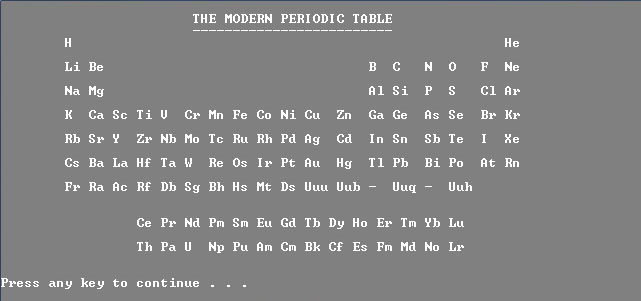

# PeriodicTable
An informative C++ program on the periodic table
<p align="center">
  
</p>  

## About the project
The periodic table is a tabular arrangement of the chemical
elements, organized on the basis of their atomic numbers,
electron configurations and recurring chemical properties. The
standard form of the table consists of a grid of elements laid out in
18 columns and 7 rows, with a double row of elements below that.
This program provides the user with access to information about
the modern periodic table. It covers information about all the 114
IUPAC approved elements. This includes data on the name,
electronic configuration, atomic weight, atomic radius etc. of every
element. The user can search for the element either by entering
the atomic number or by entering the name of the element. The
program also displays the modern periodic table as a visual aid.

## Structure Definition
  ```cpp
  struct element{
    short atomicno;    //Atomic Number
    char name[50];     //Name
    char ec[50];       //Electronic Configuration
    short group;       //Group
    short period;      //Period
    char block;        //Block
    float atomicw;     //Atomic Weight
    float en;          //Electronegativity
    short atomicr;     //Atomic Radius
    char origin[100]   //Origin Of Name
    float meltp;       //Melting Point
    float boilp;       //Boiling Point
    float density;     //Density
  }elem[115];
  ```
> **Note:**  
  This project was developed for Windows systems using the Dev C++ IDE  
  Use a window size of **80x25** for the optimal viewing experience  
  Compiled using the **mingw32-gcc-g++** compiler- Version **6.3.0-1**
